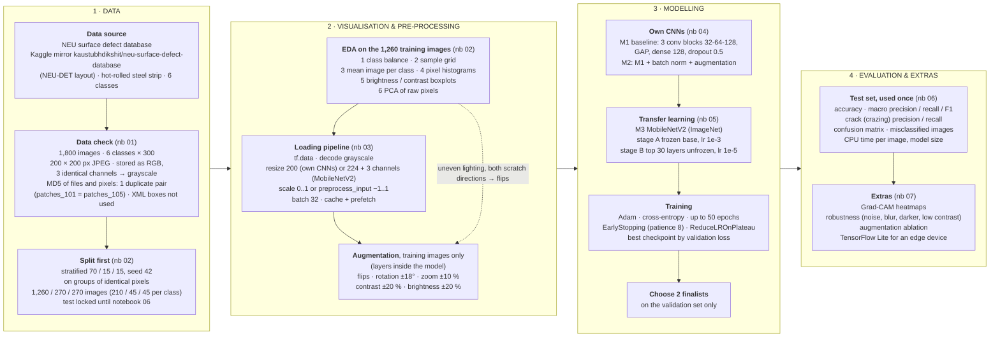

# Project flow diagram

The instructions require a flow diagram with the pre-processing and visualisation steps clearly documented. The PNG export is `docs/flow_diagram.png`.

```mermaid
%%{init: {"flowchart": {"wrappingWidth": 340, "nodeSpacing": 28, "rankSpacing": 46}, "themeVariables": {"fontSize": "15px"}}}%%
flowchart LR
    subgraph S1["1 · DATA"]
        direction TB
        A["<b>Data source</b><br/>NEU surface defect database<br/>Kaggle mirror kaustubhdikshit/neu-surface-defect-database<br/>(NEU-DET layout) · hot-rolled steel strip · 6 classes"]
        B["<b>Data check</b> (nb 01)<br/>1,800 images · 6 classes × 300<br/>200 × 200 px JPEG · stored as RGB,<br/>3 identical channels → grayscale<br/>MD5 of files and pixels: 1 duplicate pair<br/>(patches_101 = patches_105) · XML boxes not used"]
        C["<b>Split first</b> (nb 02)<br/>stratified 70 / 15 / 15, seed 42<br/>on groups of identical pixels<br/>1,260 / 270 / 270 images (210 / 45 / 45 per class)<br/>test locked until notebook 06"]
        A --> B --> C
    end
    subgraph S2["2 · VISUALISATION & PRE-PROCESSING"]
        direction TB
        D["<b>EDA on the 1,260 training images</b> (nb 02)<br/>1 class balance · 2 sample grid<br/>3 mean image per class · 4 pixel histograms<br/>5 brightness / contrast boxplots<br/>6 PCA of raw pixels"]
        E["<b>Loading pipeline</b> (nb 03)<br/>tf.data · decode grayscale<br/>resize 200 (own CNNs) or 224 + 3 channels (MobileNetV2)<br/>scale 0..1 or preprocess_input −1..1<br/>batch 32 · cache + prefetch"]
        F["<b>Augmentation</b>, training images only<br/>(layers inside the model)<br/>flips · rotation ±18° · zoom ±10 %<br/>contrast ±20 % · brightness ±20 %"]
        D --> E --> F
        D -. "uneven lighting, both scratch directions → flips" .-> F
    end
    subgraph S3["3 · MODELLING"]
        direction TB
        G["<b>Own CNNs</b> (nb 04)<br/>M1 baseline: 3 conv blocks 32-64-128,<br/>GAP, dense 128, dropout 0.5<br/>M2: M1 + batch norm + augmentation"]
        H["<b>Transfer learning</b> (nb 05)<br/>M3 MobileNetV2 (ImageNet)<br/>stage A frozen base, lr 1e-3<br/>stage B top 30 layers unfrozen, lr 1e-5"]
        I["<b>Training</b><br/>Adam · cross-entropy · up to 50 epochs<br/>EarlyStopping (patience 8) · ReduceLROnPlateau<br/>best checkpoint by validation loss"]
        J["<b>Choose 2 finalists</b><br/>on the validation set only"]
        G --> H --> I --> J
    end
    subgraph S4["4 · EVALUATION & EXTRAS"]
        direction TB
        K["<b>Test set, used once</b> (nb 06)<br/>accuracy · macro precision / recall / F1<br/>crack (crazing) precision / recall<br/>confusion matrix · misclassified images<br/>CPU time per image, model size"]
        L["<b>Extras</b> (nb 07)<br/>Grad-CAM heatmaps<br/>robustness (noise, blur, darker, low contrast)<br/>augmentation ablation<br/>TensorFlow Lite for an edge device"]
        K --> L
    end
    S1 --> S2 --> S3 --> S4
```
